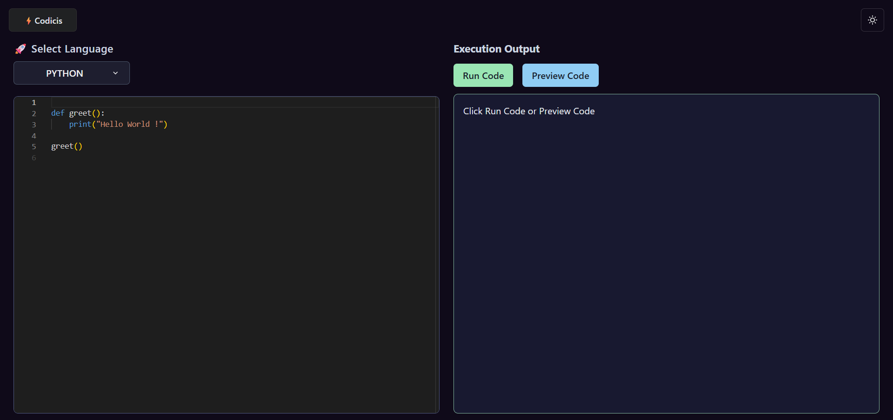
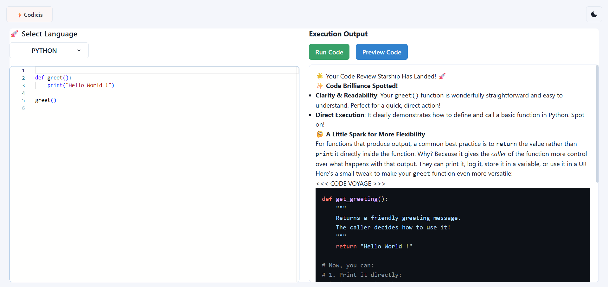
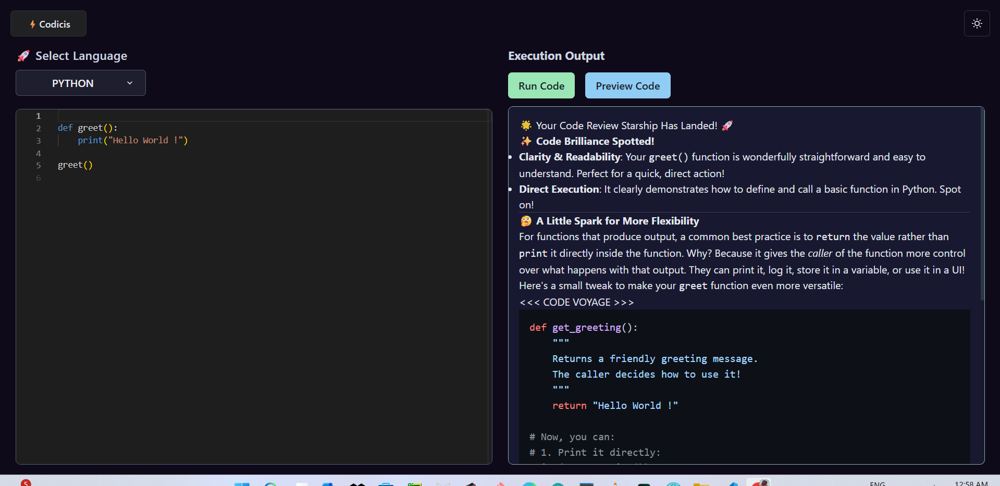

## 🌐 Live Demo

👉 https://your-deployed-link.com


# 🚀 Codicis – An AI-Powered Web Code Editor

> A Web-Based AI Powered Code Editor with Real-Time Execution & Smart Code Review

---


---

## 📖 Overview

Codicis is a full-stack AI-powered web code editor that enables users to:

- Write code in multiple programming languages
- Execute code instantly using Judge0 API
- Get smart AI code reviews powered by Google Gemini
- Switch between dark and light themes
- Enjoy a responsive layout across devices

The platform combines modern frontend UI with powerful backend execution and AI intelligence.

---

## ✨ Features

### 🖥️ Code Editor
- Monaco Editor integration
- Multi-language support (Python, JavaScript, TypeScript, Java, C#, PHP)
- Syntax highlighting
- Auto layout adjustment

### ⚡ Code Execution
- Real-time code execution using Judge0 API
- Output handling (stdout, stderr, compile errors)
- Async polling system

### 🤖 AI Code Review
- Google Gemini powered code review
- Creative, dynamic feedback formatting
- Suggestions for improvements & best practices

### 🎨 UI & UX
- Responsive layout (Mobile + Desktop)
- Dark / Light mode toggle
- Clean scrollbar customization
- Chakra UI design system

---

## 🛠️ Tech Stack

### Frontend
- React 18
- Vite
- Chakra UI
- Monaco Editor
- Axios
- React Markdown
- Framer Motion

### Backend
- Node.js
- Express.js
- Judge0 API (Code Execution)
- Google Generative AI (Gemini)
- Axios
- Dotenv

---

## ⚙️ Installation

### 1️⃣ Clone the Repository

```bash
git clone https://github.com/Sachin23Pandey/Codicis-.git
cd codicis
```

---

### 2️⃣ Setup Backend

```bash
cd backend
npm install
```

Create a `.env` file inside `backend`:

```env

GOOGLE_GEMINI_KEY=your_gemini_api_key
JUDGE0_API_URL=your_Judge0_api_key
```

Start backend server:

```bash
npm run server
```

---

### 3️⃣ Setup Frontend

```bash
cd ../
npm install
npm run dev
```

Frontend will run on:

```
http://localhost:5173
```

Backend runs on:

```
http://localhost:3000
```

---

## 🚀 Usage

1. Select a programming language.
2. Write or edit the preloaded sample code.
3. Click **Run Code** to execute it.
4. Click **Preview Code** to receive AI review.
5. Toggle between dark/light mode if desired.

---

## 📸 Project Demo

> Project features screenshots : 

### 🌙 Editor - Dark Mode


### ☀️ Editor - Light Mode


### 🤖 AI Preview


---

## 📂 Project Structure

```
codicis/
│
├── backend/
│   ├── src/
│   │   ├── controllers/
│   │   ├── routes/
│   │   ├── services/
│   │   └── app.js
│   ├── server.js
│   └── package.json
│
├── src/
│   ├── components/
│   │   ├── CodeEditor.jsx
│   │   ├── LanguageSelector.jsx
│   │   └── Output.jsx
│   ├── constants.js
│   ├── api.js
│   ├── theme.js
│   └── App.jsx
│
└── package.json
```

---

## ⚠️ Disclaimer

- This project uses the public Judge0 API endpoint.
- Rate limits may apply depending on API usage.
- AI responses are generated and may not always be 100% accurate.
- This project is intended for educational and portfolio purposes.

---

## 🔮 Future Plans

- User authentication system
- Save code snippets
- Code history tracking
- AI bug fixing suggestions
- Docker support
- Deployment on cloud platform
- Custom themes
- Code sharing via link

---

## 🤝 Contributing

Contributions are welcome!

1. Fork the repository
2. Create a new branch
3. Commit your changes
4. Push to your branch
5. Open a Pull Request

---

## 📄 License

This project is licensed under the MIT License.

---


## 🧑‍💻 **Connect With Me**

>Built with ❤️ by Sachin Pandey

- 🌐 [**GitHub**](https://github.com/Sachin23Pandey)  
- 💼 [**LinkedIn**](https://linkedin.com/in/sachin-pandey-9455a7262)

---


💡 *Codicis — Code. Execute. Improve. Repeat.* 🚀


